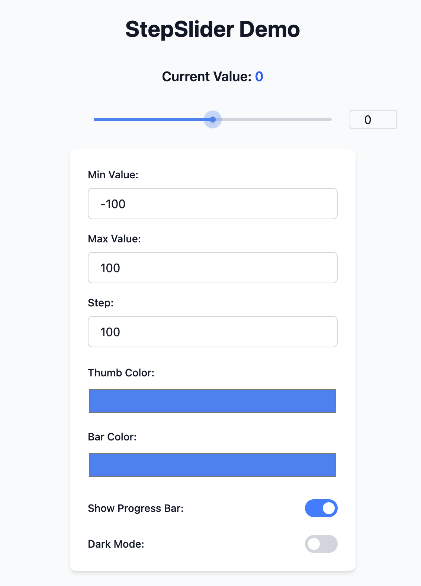

<h1 align="center">🎚️ React Enhanced Slider</h1>

<p align="center">
  <strong>Modern React slider component with step controls, smooth animations, and full customization</strong>
</p>

<p align="center">
  
</p>

---

✨ **Core Features**  
✅ Step controls & range constraints  
🎨 Customizable animation transitions  
🖥️ Touch-optimized gesture support  
📦 Lightweight (Few dependencies)  
♿ Full accessibility compliance  
🌐 TypeScript-ready definitions  

---

🚀 **Quick Start**

```bash
# Clone the repository
git clone git@github.com:gxxxr-111/react-enhanced-slider.git

# Navigate into the project folder
cd react-enhanced-slider

# Install dependencies
npm install

# Run the development server
npm run dev
