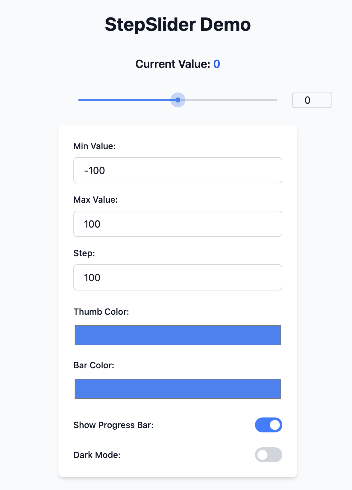

<style>
  .round {
    border-radius: 10px;
    display: block;
    margin: 0 auto;
  }
</style>

<h1 align="center">🎚️ React Enhanced Slider</h1>

<p align="center">
  <strong>Modern React slider component with step controls, smooth animations, and full customization</strong>
</p>


<p align="center">
  
</p>

---

✨ **Core Features**  
✅ Step controls & range constraints  
🎨 Customizable animation transitions  
🖥️ Touch-optimized gesture support  
📦 Lightweight (Few dependencies)  
♿ Full accessibility compliance  
🌐 TypeScript-ready definitions  

---

<!-- 🚀 **Quick Start**
```bash
npm install react-enhanced-slider
# or
yarn add react-enhanced-slider -->